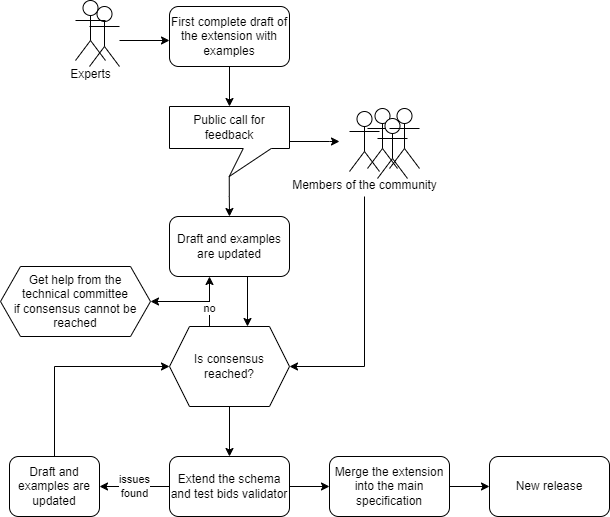

# What are BIDS Extension Proposals?

A BEP is a method of expanding the BIDS Specification to
  encompass new features or data types.

They are called BEPs because they are modeled after
  [Python Extension Proposals](https://peps.python.org/pep-0001/#what-is-a-pep) (PEPs) as
  they have been an effective community tool to change (either by updating or supplementing)
  the Python programming language. BIDS contributors adopting a similar structure has
  been useful to expand BIDS.

BEPs have grown the specification to include beyond MRI
  to new techniques, and file types and descriptors. A list of completed
  BEPS can be seen [here](https://bids.neuroimaging.io/get_involved.html#completed-beps) and
  a list of proposed/ongoing BEPs can be found [here]https://bids.neuroimaging.io/get_involved.html#extending-the-bids-specification)

## Why contribute to BIDS?

You can make something that is good even better without building it from scratch.

You can interact with and get to know other experts in the field.

A more substantial extension can lead to standalone publications, as evidenced
  by [abundant examples](https://bids-specification.readthedocs.io/en/latest/introduction.html#citing-bids).

## Overarching principles in the design of BIDS

The folder structure must not only be machine-readable but also easy to interpret
  by humans. Readability is as important as the ability to
  programmatically traverse the folder structure.

When it comes to file names within folders, redundancy trumps conciseness, so the
  files should be identifiable by their names even if removed from the folder
  structure.

If something being added to BIDS is applicable to at least 80% of use cases
  that is a very good start and should be added to the specification
  by either [opening a GitHub Issue here][issues page]
  or by working on a BEP following [the submission process](submission.md).

## When and how to start a BIDS Extension Proposal?

Small contributions (typos, rephrasing of a description, adding a single new
  metadata field) can be just added as a
  [Pull Request on GitHub](https://github.com/bids-standard/bids-specification/pulls)

Larger contributions that are expected to involve longer and more involved
  discussions should be first described in a standalone document: a Google Docs
  BEP. Development on Google Docs is preferred as this is a low barrier to entry
  for colleagues who do not use GitHub and/or Markdown,
  allowing more people to get involved.

1. Explore [the specification](bids-specification.readthedocs.io)
   and [the BEP lists](https://bids.neuroimaging.io/get_involved.html#extending-the-bids-specification)
   to find existing or ongoing efforts
   that may support what you are trying to add into the BIDS Specification.
   Someone may have already done work for you.

2. Read the
   [BIDS governance document](https://bids.neuroimaging.io/governance.html).

3. Familiarize yourself with the BIDS community by browsing current issues,
   discussions, and proposed changes on
   [the BIDS specification repository].
   Search for issues relating to your feature or BEP idea
   before creating a new issue.

4. Open an initial “issue” on
   [the BIDS specification repository] issues page
   to gauge interest in your potential BEP, and to collect
   feedback by more community members and
   [BIDS maintainers](https://github.com/bids-standard/bids-specification/blob/master/DECISION-MAKING.md#maintainers-group).
   **This is an important step before proceeding in order to make sure that
   more consensus arises and more contributors are aware what is happening**.

5. Communicate with the BIDS maintainers to make your BEP official. This
   entails registering the BEP with a number on
   [the BIDS website](https://bids.neuroimaging.io/get_involved.html).
   To obtain a number for your BEP, follow the previous steps and then [open a
   new issue](https://github.com/bids-standard/bids-website/issues)
   or [submit a pull request](https://github.com/bids-standard/bids-website/pulls) to the
   [website GitHub repository](https://github.com/bids-standard/bids-website/),
   cross-linking to any other already existing issues.

6. Create a draft of your extension by discussing among colleagues. The
   [BIDS Extension Proposal template](https://docs.google.com/document/d/1W7--Mf3gCCb1mVfhsoRJCAKFhmf2umG1PFkyZ1jEgMw/edit#)
   provides some boilerplate and formatting conventions.

7. List on the draft the contributor(s) leading the effort.

8. Share the draft (remember to
   [share a link that allows anyone to comment](https://support.google.com/docs/answer/2494822?co=GENIE.Platform%3DDesktop&hl=en))
   with the
   [bids-discussion mailing list](https://groups.google.com/forum/#!forum/bids-discussion)
   and ask for comments.

9. Incorporate the feedback and strive for consensus.

10. Help to merge the extension into the main specification (this will require
   converting the proposal to Markdown and submitting a Pull Request at
   [the BIDS specification repository])

11. If necessary, contribute a pull request to the
      [BIDS Validator repository](https://github.com/bids-standard/bids-validator)
      as well to incorporate the extension.

## Advice for extending BIDS

### Limit flexibility, consider tool developers

One of the aims of BIDS is to make reusing data easier. This means that when
  proposing an extension you need to put yourself in the shoes of someone who will
  receive a BIDS dataset and attempt to analyze it. Additionally, consider
  developers that will try to write tools that take BIDS datasets as inputs.
  It is worth assessing how much additional code different ways of approaching your
  extension may cause.

The most common situation where the trade-off between flexibility and ease of
  tool building comes up is in choosing file formats. For example, allowing multiple
  different file formats to be used to represent the same data type is flexible,
  but requires developers to provide support for all of them. As an example,
  iEEG-BIDS and EEG-BIDS
  [surveyed the community](https://bids.berkeley.edu/news/bids-megeegieeg-data-format-survey)
  to find out about most common formats and selected only a few formats based on
  usage and their openness.

### Get the community involved

Try to reach out to colleagues working with the type of data you are trying to
  add support for. The more people looking at your extension the better it will
  become through discussions.

### Be consistent with the main specification

The main specification follows some general rules. For example, see the
  [rules on participant labels](https://bids-specification.readthedocs.io/en/stable/02-common-principles.html#participant-names-and-other-labels).

Try not to deviate from BIDS conventions in your extension.

### Avoid backward incompatible changes

BIDS is already incorporated in many tools - proposing a change that will render
  already released BIDS datasets not BIDS-compliant will cause a lot of confusion
  and will force developers to update their code. We should strive to avoid such
  situations.

Having said that, one day we will have to break backwards compatibility. If you
  have an idea for a backwards-incompatible change please add it as an issue to the
  [BIDS 2.0 GitHub repository](https://github.com/bids-standard/bids-2-devel).

### Use existing and common practices/formats

It’s likely that certain data types are commonly stored in a particular way in
  your sub-field. If this is the case try adopting this way unless it makes your
  extension too inconsistent with the main specification. A good example of such
  adoption is the
  [bvec/bval file format](https://bids-specification.readthedocs.io/en/stable/04-modality-specific-files/01-magnetic-resonance-imaging-data.html#required-gradient-orientation-information)
  for storing diffusion metadata.

### Try to link with other existing standards and ontologies

There are many standardization attempts out there. When proposing your extension
  consider gathering inspiration and directly linking to other standards. A good
  example of this is linking metadata fields to corresponding DICOM tags.

## Common pitfalls

### Relying on merging the extension on a set timeline

We have found it is very difficult to predict how long a BEP
  will take to merge into the standard. One challenge that has occurred in the
  past is a doctoral student requiring acceptance of their work as a requirement
  for graduation. We do not recommend yoking contributions to the BIDS community
  (or any volunteer-led open source community) to strict timelines to avoid the
  uncertainty around domain-specific community engagement, feedback from other
  BIDS contributors, and responding to reviews.

### Not considering domain- or field-specific guidelines

In many neuroscience fields there have been past developments and efforts to
  implement standards, either formally or informally. If possible, BEPs
  should embrace these rather than trying to come up with
  alternative standards. The BEP should therefore inventorize
  and review past and existing work that may be relevant to the BEP.

### Not considering DICOM fields

Many of the modalities we use have an associated standard, like DICOM for instance.
  While BIDS is not specifically about data format, a lot of metadata information are
  stored in data files and there is rarely a good reason for using a different name
  than one from other established standards. In using DICOM it is reasonable to
  [check what DICOM has already developed](https://www.dicomstandard.org/) and see
  if there is overlap. In a similar fashion, when relevant, we recommend having a
  `sourcedata/` folder in example datasets to include DICOM files.
  You can delete the data and keep the header, removing any
  [personally identifying information](https://www.datacenters.com/news/everything-you-need-to-know-about-pii-personal-identifiable-information),
  also known as PII or "Personal Data" under the
  [General Data Protection Regulation (GDPR)](https://en.wikipedia.org/wiki/General_Data_Protection_Regulation).

### Not building up a user community to support the BEP

Merging BEPs only happens following a community review. It
  is therefore helpful to get the stakeholders on board early (i.e. while
  writing the BEP) rather than at the review stage. Diversity in
  the team contributes to the quality of the extension proposal. We recommend that
  the core team has representatives from 3 different labs, preferably also with a
  mix of more junior and more senior contributors. You may also consider
  requesting explicit support letters from external labs.

### How to turn on email notifications about suggestions and comments for Google Docs

[the BIDS specification repository]: https://github.com/bids-standard/bids-specification/
[issues page]: https://github.com/bids-standard/bids-specification/issues
